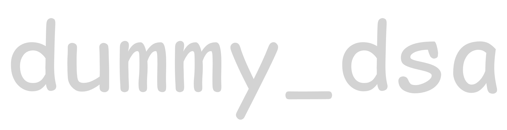

# dummy_dsa



A collection of data structures and algorithms implemented in C17 using GCC.

## Project Setup

### Requirements

- GCC
- Make

### Build

```bash
# Debug build (default)
make

# Release build
make release

# Clean build output
make clean
```

### Debug

```bash
# Debug build with Address Sanitizer and Undefined Behavior Sanitizer
make debug
```

### Run

```bash
# Compile and run the full project
make run

# Compile and run a single file
make run-file main.c
```

## Project Structure

```text
project/
├── Makefile
├── README.md
├── main.c
├── build/              ← generated, not committed
├── algorithms/
└── ds/
    └── stack/
        ├── stack.h
        └── stack.c
```

## Make Commands

| Command                  | Description                                |
| ------------------------ | ------------------------------------------ |
| `make`                   | Debug build (default)                      |
| `make debug`             | Debug build with ASan, UBSan, `-g3`        |
| `make release`           | Optimised build with `-O2`, assertions off |
| `make run`               | Compile full project and run               |
| `make run-file <file.c>` | Compile and run a single file              |
| `make clean`             | Remove build output                        |
